# Monitoring a Mendix application using Munin

[Munin](http://munin-monitoring.org/) is 'a networked resource monitoring tool that can help analyze resource trends and "what just happened to kill our performance?" problems.'

The Mendix m2ee-tools software ships with a built-in munin plugin.

## Mendix munin plugin

A plugin to use with munin-node is available in the munin folder in the m2ee-tools source. If you're using the Debian packages already, it's in an additional package named `munin-plugins-m2ee` which installs the plugin at `/usr/share/munin-m2ee/plugins/mxruntime_`.

To activate this plugin for a specific application, just symlink the script, appending the user name of the account the application uses and make sure you run the plugin as this user by defining this in a file in the plugin-conf.d directory.

E.g. when monitoring 'Some Customer', using server account somecust:

    example.mendix.net:/etc/munin/plugins 0-# ln -s /usr/share/munin-m2ee/plugins/mxruntime_mxruntime_somecust

    example.mendix.net:/etc/munin/plugin-conf.d 0-# cat mxruntime
    [mxruntime_somecust]
    user somecust
    group somecust

Use `munin-run mxruntime_somecust` to test the plugin.

## Manual testing

When using the interactive m2ee command line, the commands `munin_config` and `munin_values` are available to trigger the collection of statistics and to view the same output as the plugin generates.

## The smaps statistics

The Mendix Runtime munin plugin contains a graph that, when running on Linux, explores the internal memory usage of the JVM process, using information from the `smaps` file that is available via the `/proc/` file system for the JVM process id. This graph is still a bit experimental, as it requires quite some educated guessing to be done to interpret the memory information that can be read from the Linux kernel.

In order for the plugin to be able to read this information, the plugin must run with the primary group set to the same group id as the runtime process itself is using. For munin versions before 2.0.65, munin-node only adds the group that is defined in the plugin configuration as secondary group. In order to fix this, a [patch for munin-node is necessary](https://github.com/munin-monitoring/munin/pull/305), which actually also fixes a security issue.

## Examples

Here's some examples of graphs this plugin will show. Besides these graphs, it's of course very useful to also have the standard set of munin graphs displaying operating system memory and cpu usage, and disk I/O usage to correlate with.

The example application is a quite busy application which mainly handles interactive usage from end users in the browser.

### JVM Heap Memory Usage

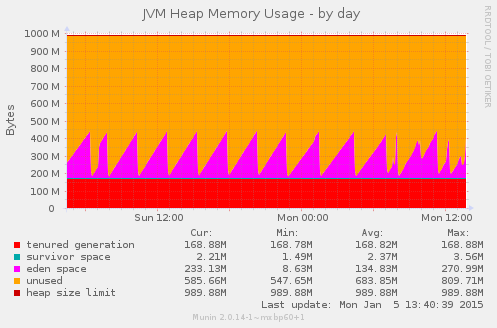

The JVM Heap is the memory space in which Java objects live. Java objects can be created manually in a Java action in a Mendix application, but every object that is handled in a microflow also translates to a Java object under the hood. New objects are created in __eden space__, and if they live long enough, the JVM garbage collector moves them via the __survivor space__ to the __tenured generation__.

In this graph, we can see the JVM garbage collector do its work. For example, at tuesday arond 10:45 PM, we can see a garbage collection happening in the 'tenured generation'. The result shows that of the 2.6GiB of memory, there was actually 900MiB still in use, and the rest of the memory has been cleaned up to be reused. Besides this, there are many small garbage collections in the eden space happening all the time.

### JVM Process Memory

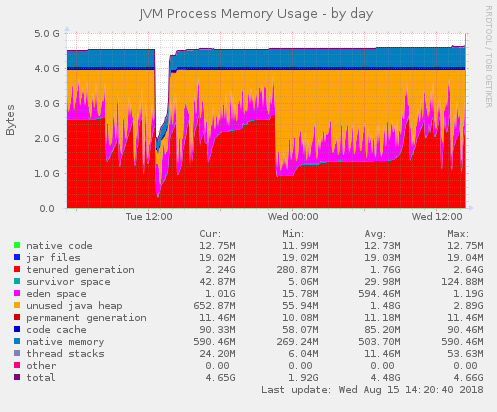

The JVM Process Memory is the total size of the JVM process, as seen from the operating system memory perspective. Besides the object heap, which we saw in the previous graph, there's overhead of actual JVM code itself, program code of the Mendix Runtime and extra libraries used. Also visible is __native memory__, which are extra segments of raw memory that can be allocated by java libraries.

Note that when the application is restarted, we see the actual memory usage of the process drop and grow again, when the JVM Heap starts being used again. The previous JVM Heap graph always shows the maximum possible size for convenience reasons.

### Webserver Thread pool

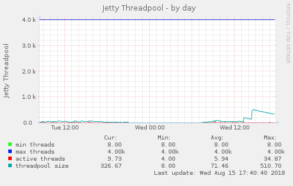

This graph shows the thread pool that handles incoming HTTP connections to the Mendix Runtime process.

Apparently, at around 2 PM there was a spike in the amount of concurrent external requests that were handled. Afterwards, the amount of idle threads slowly decreases again.

### Total amount of JVM threads

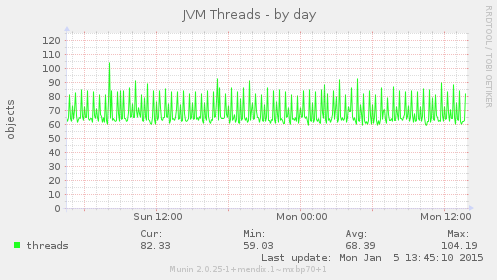

This is the total amount of threads that lives in the JVM process. The amount of threads roughly corresponds to the amount of currently handled external requests (retrieving and committing objects by the browser client), together with microflows started from an external request, a web service call, or started by a scheduled event. The `show_all_thread_stack_traces` command on the interactive m2ee command line will show details about all these threads for debugging.

In this graph, we see a few huge spikes just after 1 PM and 2 PM. Apparently these running actions were the result of external requests to the application, since we see the same pattern in the previous graph of webserver threads.

### Webserver requests

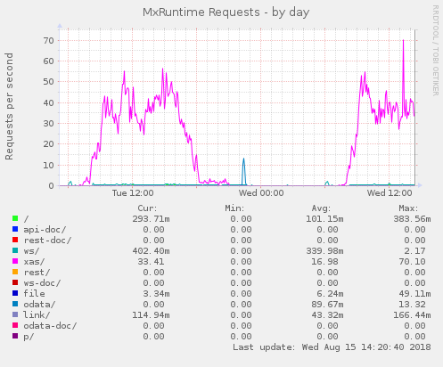

The requests graph lists the amount of incoming HTTP requests to the application, split per endpoint. For example, the __xas__ endpoint handles queries from the browser client to retrieve data or execute a microflow when clicking a button. The __ws__ handles XML web service requests, etc.

In this graph we see that the requests that caused the amount of threads to spike were requests that were actually originating from a user doing things in the web client.

### Amount of logged in users

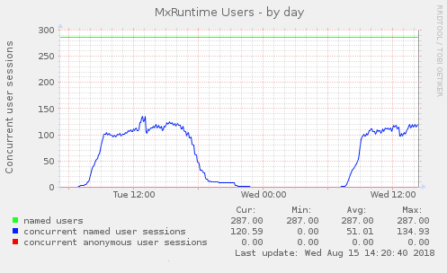

A Mendix application has user accounts which are created in the application. This graph shows the total amount of __named users__ which exist in the application, as well as the amount of logged in __named user sessions__, and logged in __anonymous user sessions__.

In the graph we can see that this application probably does not allow anonymous temporary user accounts to exist, and only allows existing registered users to log in. During the day, there's a fair amount of users interacting with the application.

### Object Cache

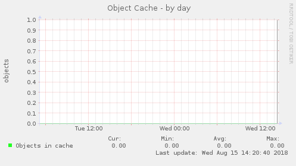

The Object Cache graph shows the amount of objects that are kept in the memory of the runtime (and also live in the Java Heap memory space that we saw above). Mendix versions before 7 used this object cache to keep track of objects while they were being edited in the web client or manipulated in mircoflows. In the interactive m2ee program, statistics for this cache can be shown with the `show_cache_statistics` command.

Since the example application is using Mendix 7, the graph lists zero objects in the cache.

### Amount of database queries executed

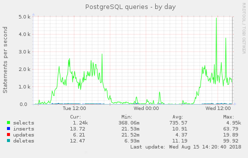

The Mendix Runtime keeps track of the amount of __select__, __insert__, __update__ and __delete__ queries which are sent to the database, while doing object retrieval and committing changes.

In this example graph, we see that the application is doing lookups in the database quite heavily, compared to the amount of changes done. The end users are probably clicking around through different complex screens all the time. Also, XPath retrieve operations from the web client may result in multiple different select queries being fired off to the database.

### PostgreSQL database size

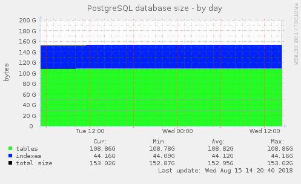

The database size graph shows the total size of the database on disk, split in actual data (__tables__) and __indexes__. This amount of allocated disk space might also contain freed up space fragments that are available for reuse after processing update and delete queries.

(This graph is only visible when using a PostgreSQL database)

### PostreSQL Connections

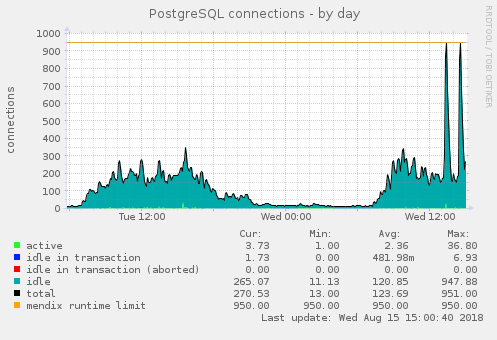

The connection statistics show us how many connections are currently opened to the database. __Active__ connections are executing a database query right now. Connections that are __idle in transaction__ are likely longer running microflows that have a database transaction open, but are not currently executing a database activity. A transaction shown as __aborted__ is being cleaned up after being interrupted because of a problem. The __total amount__ of open connections as seen by PostgreSQL also includes the connection running the query to retrieve the monitoring data and database backup (dump) operations. The Mendix Runtime __limit__ is the upper limit on amount of open connections for the Mendix Runtime connection pooling.

When database connections are quickly opened and closed, they result in new idle connections which are left behind. If there are no new transactions immediately requiring a connection, the amount of idle connections in the connection pool decreases slowly. When the graph shows an amount of idle connections, but no active or idle transactions, we know that the application behaviour is very spikey, pushing up the number of open connections for a very short time in between the measurements done by the monitoring system.

The connection amounts are directly read from PostgreSQL, so the connection that is used separately for looking up the statistics is always also counted as active connection.

In this graph, we can see that the spike in external requests caused a huge explosion of concurrent database queries, leading to high spikes in open database connections.

(This graph is only visible when using a PostgreSQL database)

### PostgreSQL updated tuples

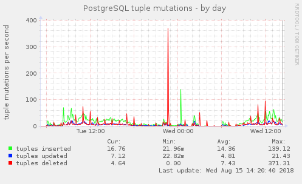

This graph might look similar to the one displaying insert, update and delete queries done. However, different update or delete query might cause a different amount of actual database table rows (called tuples in PostgreSQL language) to be touched.

(This graph is only visible when using a PostgreSQL database)

- - -

[Back to overview](README.md)
