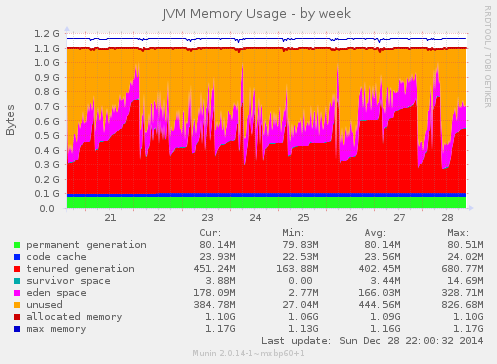
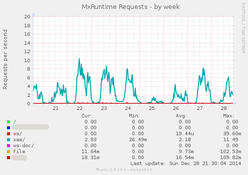
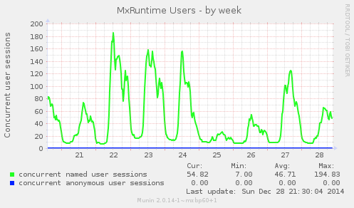
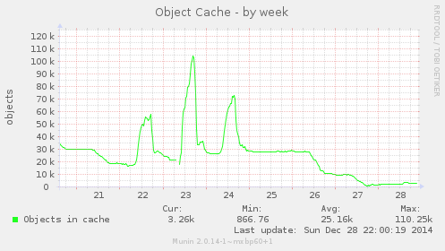
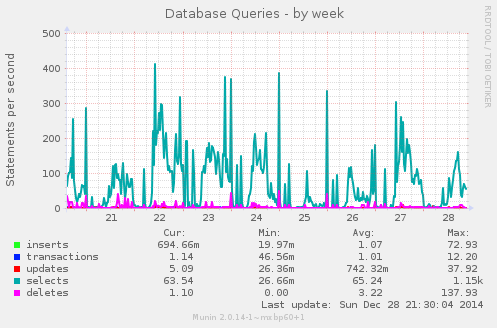
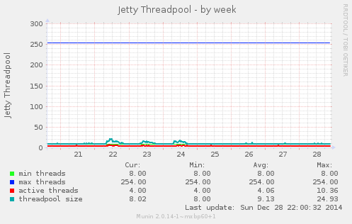

# Monitoring a Mendix application using Munin

[Munin](http://munin-monitoring.org/) is 'a networked resource monitoring tool that can help analyze resource trends and "what just happened to kill our performance?" problems.'

The Mendix m2ee-tools software has built in munin support.

## Mendix munin plugin

A plugin to use with munin-node is available in the munin folder in the m2ee-tools source. If you're using the Debian packages already, it's in an additional package named `munin-plugins-m2ee` which installs the plugin at `/usr/share/munin-m2ee/plugins/mxruntime_`.

To activate this plugin for a specific application, just symlink the script, appending the user name of the account the application uses and make sure you run the plugin as this user by defining this in a file in the plugin-conf.d directory.

E.g. when monitoring 'Some Customer', using server account somecust:

    example.mendix.net:/etc/munin/plugins 0-# ln -s /usr/share/munin-m2ee/plugins/mxruntime_mxruntime_somecust

    example.mendix.net:/etc/munin/plugin-conf.d 0-# cat mxruntime
    [mxruntime_somecust]
    user somecust
    group somecust

Use `munin-run mxruntime_somecust` to test the plugin.

## Manual testing

When using the interactive m2ee command line, the commands `munin_config` and `munin_values` are available to trigger the collection of statistics and to view the same output as the plugin generates.

## The smaps statistics

The Mendix Runtime munin plugin contains a graph that, when running on Linux, explores the internal memory usage of the JVM process, using information from the `smaps` file that is available via the `/proc/` file system for the JVM process id. This graph is still a bit experimental, as it requires quite some educated guessing to be done to interpret the memory information that can be read from the Linux kernel.

In order for the plugin to be able to read this information, the plugin must run with the primary group set to the same group id as the runtime process itself is using. Sadly, munin-node only adds the group that is defined in the plugin configuration as secondary group. In order to fix this, a [patch for munin-node is necessary](https://github.com/munin-monitoring/munin/pull/305), which actually also fixes a security issue.

Also, the calculations in this plugin assume that the JVM settings for initial and maximum Java Object Heap (-Xms and -Xmx) are set to the same value!

## Examples

Here's some examples of graphs this plugin will show:

There are two more graph types, which are brand new: JVM Process Memory Usage (the smaps one) and a graph of the Total Amount of JVM Threads. I'll add examples of those later.

- - -

[Back to overview](README.md)
